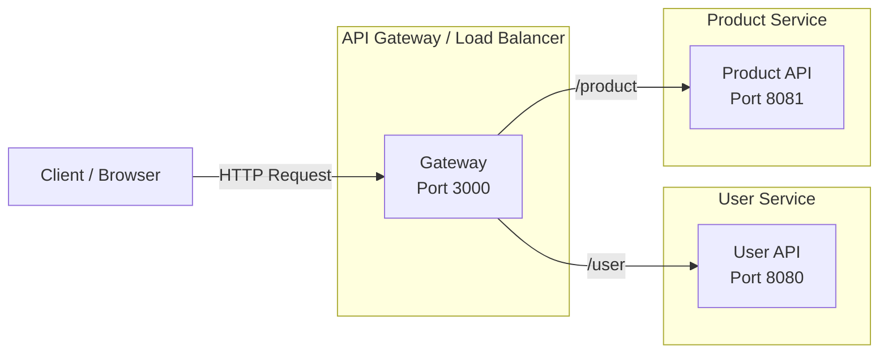

```mermaid
flowchart LR
    Client[Client / Browser]

    subgraph Gateway["API Gateway / Load Balancer"]
        GW[Gateway<br/>Port 3000]
    end

    subgraph UserService["User Service"]
        US[User API<br/>Port 8080]
    end

    subgraph ProductService["Product Service"]
        PS[Product API<br/>Port 8081]
    end

    Client -->|HTTP Request| GW
    GW -->|/user| US
    GW -->|/product| PS
```
